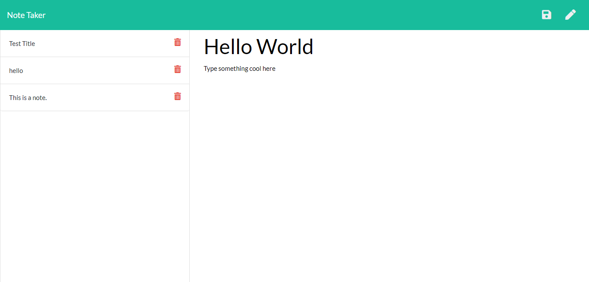

# homework_10_note_taker

## Description

Create an application that can be used to write, save, and delete notes. This application will use an express backend and save and retrieve note data from a JSON file.

## Acceptance Criteria

Application should allow users to create and save notes.

Application should allow users to view previously saved notes.

Application should allow users to delete previously saved notes.

## User Story

AS A user, I want to be able to write and save notes

I WANT to be able to delete notes I've written before

SO THAT I can organize my thoughts and keep track of tasks I need to complete

## Installation

Application is hosted on heroku, so there is no need to install

## Usage

Not Applicable 

## Technologies Used

NPM - Inquirer Package, Express, Heroku

## Problems I faced

I had so issues with a file output that was hidden but we removed it and it worked

## Credits

Ryan Witherspoon

## Image

## Links
[link to GitHub!](https://ryanwit.github.io/homework_10_team_profile_generator/.)

[link to Heroku!](https://github.com/ryanwit/homework_10_team_profile_generator)

[link to Screencastify Demo!](https://drive.google.com/file/d/1rrUyZWQYi47d-9Ed4cdVNochJUtbFbze/view)

# License